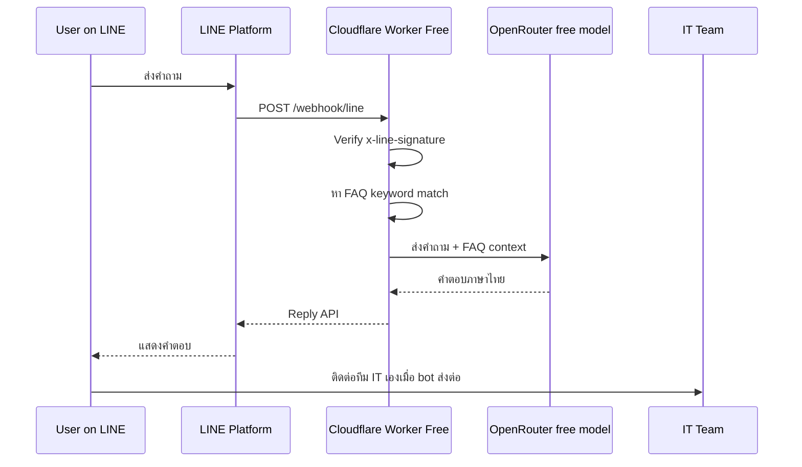

# LINE OA + OpenRouter IT Support Architecture

## เป้าหมาย

สร้าง LINE Official Account ที่ช่วยตอบคำถาม IT support ซ้ำ ๆ เช่น ลืมรหัสผ่าน, ต่อ Wi-Fi ไม่ได้, printer, VPN และช่วยเก็บข้อมูลที่จำเป็นก่อนส่งต่อทีม IT โดยเน้นใช้ฟรีทั้งหมดในช่วง MVP

## สถาปัตยกรรมฟรีที่แนะนำ

## ทำไมถึงฟรี

- LINE: ใช้ Reply API เฉพาะตอน user ทักมา ไม่ใช้ push/broadcast ที่ถูกนับเป็น message quota
- OpenRouter: ตั้ง model เป็น `openrouter/free`
- Hosting: Cloudflare Workers Free มี HTTPS และ free quota เพียงพอสำหรับ MVP
- Storage: ยังไม่ใช้ database เก็บ FAQ ใน code/file ก่อน

## MVP Components

- `src/worker.js`: Cloudflare Worker สำหรับ deploy ฟรีแบบไม่มี dependency
- `wrangler.toml`: config สำหรับ Worker ถ้าต้องการ deploy ด้วย CLI
- `src/server.js`: Node server สำหรับ local development หรือ hosting ที่รองรับ Node
- `data/faq.json`: FAQ seed สำหรับ Node version

## ข้อจำกัดของแนวฟรี

1. Free model อาจช้าหรือ rate limit ได้
2. Cloudflare Workers Free มี request limit รายวันและ CPU time จำกัด
3. ถ้า OpenRouter ตอบช้า อาจทำให้ LINE reply token หมดอายุ
4. ไม่มี conversation memory ถาวรใน MVP
5. ไม่มี auto ticket creation เพื่อเลี่ยง service ที่อาจมีค่าใช้จ่าย

## Free-First Roadmap

1. MVP: Worker + OpenRouter free + embedded FAQ
2. เพิ่ม FAQ ให้ครบ 20-50 คำถามซ้ำ ๆ
3. เพิ่ม logging แบบไม่เก็บข้อมูลลับด้วย Cloudflare dashboard logs
4. ถ้าต้องเก็บข้อมูล ใช้ Cloudflare KV/D1 free tier อย่างระมัดระวัง
5. ถ้าเริ่มมีผู้ใช้เยอะ ค่อยประเมิน paid model หรือ paid hosting แยกเป็นเฟสหลัง

## Guardrails

- ตรวจ `x-line-signature` ทุกครั้งก่อนอ่าน event
- อย่าให้ AI เดาข้อมูลระบบภายในที่ไม่มีใน FAQ/context
- เมื่อไม่มั่นใจ ให้ถามข้อมูลเพิ่มหรือส่งต่อทีม IT
- จำกัดข้อมูลส่วนบุคคลที่ส่งเข้าโมเดลเท่าที่จำเป็น
- log error แบบไม่เก็บ access token หรือข้อมูลลับ
- ไม่ใช้ LINE push/broadcast ใน MVP

## Deployment Checklist

1. สร้าง Cloudflare Worker Free
2. วางโค้ดจาก `src/worker.js`
3. ตั้ง secrets: `LINE_CHANNEL_ACCESS_TOKEN`, `LINE_CHANNEL_SECRET`, `OPENROUTER_API_KEY`
4. ตั้ง vars: `OPENROUTER_MODEL=openrouter/free`, `SUPPORT_TEAM_CONTACT`
5. ทดสอบ `GET /health`
6. ตั้ง LINE webhook URL เป็น `https://worker-url/webhook/line`
7. กด Verify webhook ใน LINE Developers Console
8. Add friend แล้วทดสอบคำถามจริง
